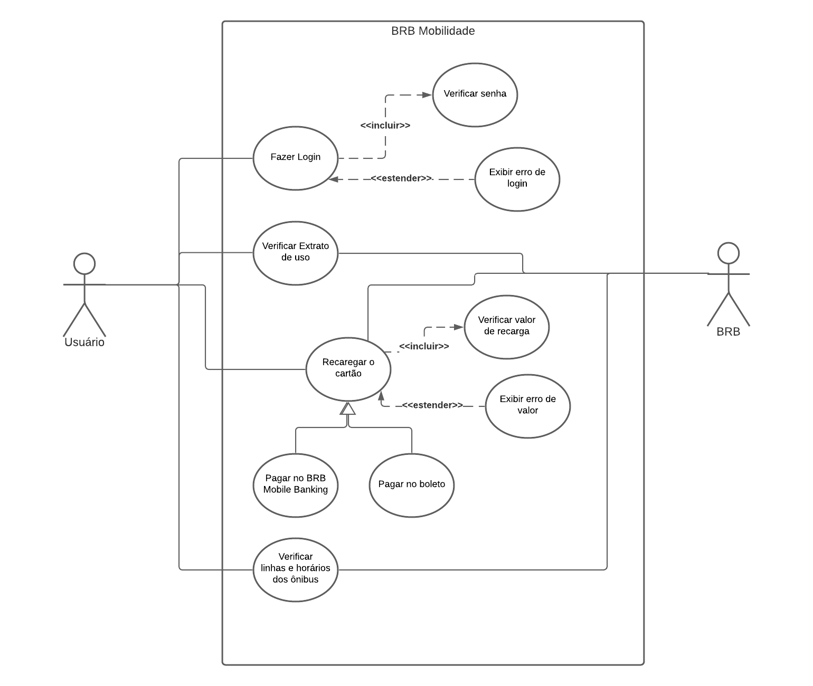

## Introdução
O diagrama de caso de uso é usados para descrever como o usuário interage com o sistema,por meio de símbolos que representam o sistema,os atores, os casos de uso e os relacionamentos.
## Metodologia 
Para fazer uma representação do Diagrama de Caso de uso foi utilizado o [Lucidchart](https://www.lucidchart.com/) para facilitar na elaboração da diagramação.

## Diagrama de Caso de Uso
### Geral

### UC01- Fazer login
| Sigla | Definição |
|:----: |:----: |
| Descrição | Logar no sistema|
| Ator |Usuário|
|Pré-condições| Possuir cartão cidadão do Governo do Distrito Federal|
|Fluxo principal| Entrar no app e inserir número do cartão e CPF da dono do cartão|
|Fluxo alternativo| Não existe|
|Fluxo de exceções|1. Usuário não é o dono do cartão   2.Número do cartão não existe|
|Pós-condição| O usuário será redirecionado para a página principal|

### UC02- Verificar Extrato de uso
| Sigla | Definição |
|:----: |:----: |
| Descrição |  Verificar o extrato de uso do cartão |
| Ator |Usuário e BRB|
|Pré-condições| Estar logado no sistema|
|Fluxo principal| Acessar o Extrato de uso |
|Fluxo alternativo| Não existe|
|Fluxo de exceções|Não tem|
|Pós-condição| O usuário será redirecionado para a página contendo os extratos mensais |

### UC03- Recarregar o cartão
| Sigla | Definição |
|:----: |:----: |
| Descrição | Verificar o extrato de uso do cartão|
| Ator |Usuário e BRB|
|Pré-condições| Estar logado no sistema|
|Fluxo principal| Clicar no botão Recarga de cartão |
|Fluxo alternativo| Não existe|
|Fluxo de exceções|Não tem|
|Pós-condição| O usuário será redirecionado para outra página para inserir o valor que deseja recaregar|

### UC04- Pagar no BRB Mobile Banking
| Sigla | Definição |
|:----: |:----: |
| Descrição | Recarregar o cartão pela conta no banco BRB|
| Ator |Usuário|
|Pré-condições| Ter acessado o a área de recarga do cartão e inserido o valor desejado|
|Fluxo principal| Clicar no botão pagar no BRB Mobile Banking|
|Fluxo alternativo| Não existe|
|Fluxo de exceções|Não tem|
|Pós-condição| O usuário será redirecionado para outro aplicativo,BRB Mobile Banking, para recarregar o cartão|

### UC05- Pagar no boleto
| Sigla | Definição |
|:----: |:----: |
| Descrição | Recarregar o cartão pela conta no banco BRB|
| Ator |Usuário|
|Pré-condições| Ter acessado o a área de recarga do cartão e inserido o valor desejado|
|Fluxo principal| Clicar no botão pagar no boleto|
|Fluxo alternativo| Não existe|
|Fluxo de exceções|Não tem|
|Pós-condição| O usuário recebera um boleto em pdf e com o codigo do boleto|

### UC06- Verificar linhas e horários dos ônibus
| Sigla | Definição |
|:----: |:----: |
| Descrição | Busca de linhas e horários dos ônibus|
| Ator |Usuário|
|Pré-condições| Estar logado no sistema|
|Fluxo principal| Clicar no botão Linhas e horários|
|Fluxo alternativo| Acessar atraves de suas linhas favoritas|
|Fluxo de exceções|Não tem|
|Pós-condição| Será mostrado para o usuário as linhas e horários dos ônibus|

## Versionamento
| Versão| Data| Alteração | Integrante |
| :------------- :|:--------------:| :-----------:|:----------:|
| 1.0| 07/10 |Introdução e Diagramade Caso de uso|  [Iago Theóphilo](https://github.com/IagoTheophilo)|
| 1.2| 07/10 |Introdução e Diagramade Caso de uso|  [Iago Theóphilo](https://github.com/IagoTheophilo)|
| 1.3| 08/10 |Elaboração do UCs |  [Iago Theóphilo](https://github.com/IagoTheophilo)|