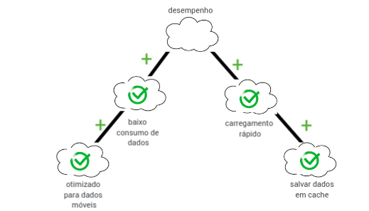
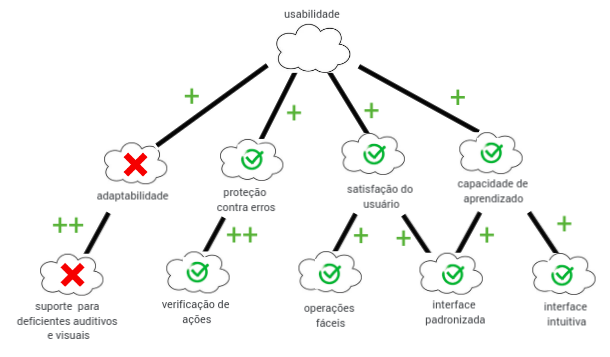
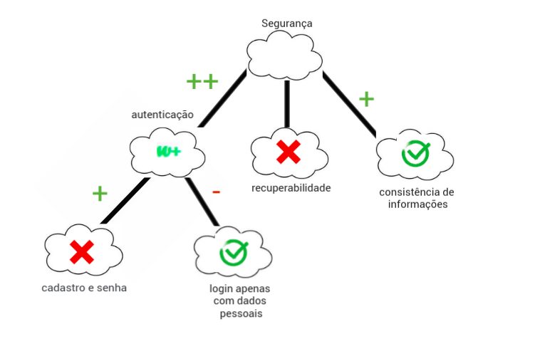

# NFR Framework

Trata-se de um framework conceitual para condução da Engenharia de Requisitos orientada aos requisistos não funcionais, com uma extensão que apoia suposições para avaliação de satisfação das metas-flexíveis.

Os diagramas apresentam as ligações e influências entre os requisitos não funcionais satisfeitos e não satisfeitos do APP.

## NFR Desempenho

## NFR Portabilidade

## NFR Usabilidade

## NFR Segurança

## Legenda dos símbolos

## NFR Versionamento
| Versão| Data| Alteração | Integrante |
| :------------- :|:--------------:| :-----------:|:----------:|
| 1.0| 24/10 |Criação do NFR de desempenho e portabilidade| [Danilo Domingo](https://github.com/danilow200)|
| 1.1| 24/10 |Criação do NFR de usabilidade e segurança| [Arthur Paiva](https://github.com/arthurpaivat)|
| 1.2| 24/10 |Adição da legenda| [Arthur Paiva](https://github.com/arthurpaivat)|