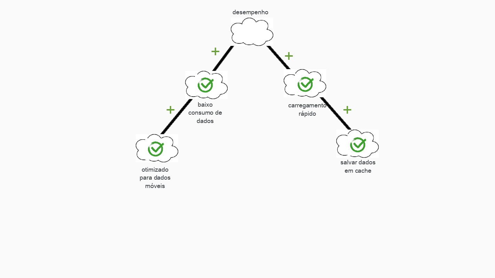
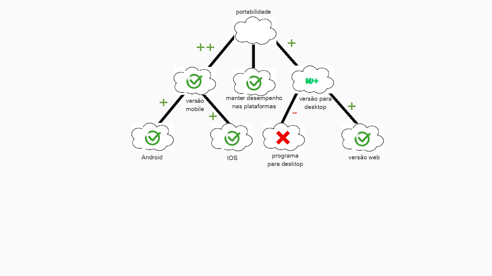

# NFR Framework

Trata-se de um framework conceitual para condução da Engenharia de Requisitos orientada aos requisistos não funcionais, com uma extensão que apoia suposições para avaliação de satisfação das metas-flexíveis.

## Desempenho

## Portabilidade

## Versionamento
| Versão| Data| Alteração | Integrante |
| :------------- :|:--------------:| :-----------:|:----------:|
| 1.0| 24/10 |Criação do NFR de desempenho e portabilidade| [Danilo Domingo](https://github.com/danilow200)|