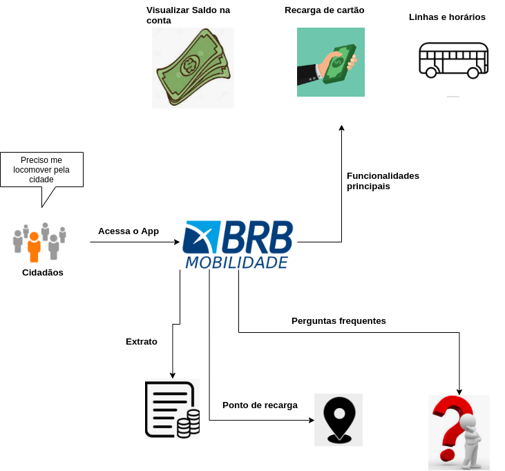

## Introdução
  Um Rich Picture fornecem um mecanismo para aprender sobre problemas complexos ou mal definidos desenhando representações detalhadas deles.
## Visão Geral v0

## Versionamento
| Versão| Data| Alteração | Integrante |
| :------------- :|:--------------:| :-----------:|:----------:|
| 1.0| 23/09 |Adição da Introdução e Vissão Geral v0| [Iago Theóphilo](https://github.com/IagoTheophilo)|s