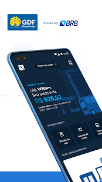

# BRBMobilidade

## Sobre o BRBMobilidade

O BRB Mobilidade foi implementado para facilitar o dia a dia dos usuários do Bilhete Único do Distrito Federal.

O aplicativo está disponibilizado nas plataformas [Google play](https://play.google.com/store/apps/details?id=br.com.brb.mobilidade) e [App Store](https://apps.apple.com/br/app/brb-mobilidade/id1485813954).  Está na sua versão 1.3.4 até o presente momento da produção dessa wiki.

## Funcionalidades disponíveis

• Consulta de saldo e extrato dos cartões. Vale Transporte e Brasília Cidadã.

• Consulta aos pontos de recarga.

• Recarga de cartão por boleto.

• Consulta de itinerário e grade horária das linhas.

      

## As técnicas e ferramentas utilizadas

  No início da elaboração desse projeto foram elencadas algumas ferramentas no [Planejamento](https://requisitos-de-software.github.io/2020.1-BRBmobilidade/planejamento/) para nos auxiliar  no comprimento das atividade no percorrer do curso.
  
  Durante a elaboração das atividades foram inseridas novas ferramentas para elaboração dos artefatos e entragas como:

  [Figma](https://www.figma.com/): Para elaboração do Protótipo de alta fidelidade em [Validação](https://requisitos-de-software.github.io/2020.1-BRBmobilidade/Analise/Validacao/prototipo/)

  [Lucidchart](https://www.lucidchart.com/): Para elaboração do Diagrama de Caso de Uso em [Caso de Uso](https://requisitos-de-software.github.io/2020.1-BRBmobilidade/Modelagem/casosdeuso/)

  [Youtube](https://www.youtube.com/playlist?list=PLzpBgYMXTPE63x_jUEh97u2os2g_xhYUm): Para disponibilização dos vídeos gravados na [Apresentações](https://requisitos-de-software.github.io/2020.1-BRBmobilidade/Apresenta%C3%A7%C3%B5es/apresentacao/)

## As facilidades e dificuldades encontradas para a realização do projeto. 

  É importate resaltar que o curso de Engenharia de Software na Universidade de Brasília é um curso presencial. E devido a esse fato, o grupo obteve inicialmente uma dificuldade em se adaptar ao sistema de educação à distância, mas nada que o prejuticasse o aprendizado em relação ao conteúdo ministrado na disciplina.

  Tendo como base os repositórios disponibilizados na [organização](https://github.com/Requisitos-de-Software) da matéria de requisitos de software no github, o grupo obeteve facilidade no aprendizado do conteúdo devido aos trabalhos disponibilizados por semestres anteriores.

## EQUIPE

Arthur Paiva | Danilo Domingo | Iago Theophilo | Gabriel Hussein
:-------------------------:|:-------------------------:|:-------------------------:|:-------------------------:
  |   |  |  

Wiki do aplicativo BRB Mobilidade para disciplina de requisitos de software 2020.1. Repositório criado para reúnir e analisar requisitos de software do aplicativo mobile BRB Mobilidade.