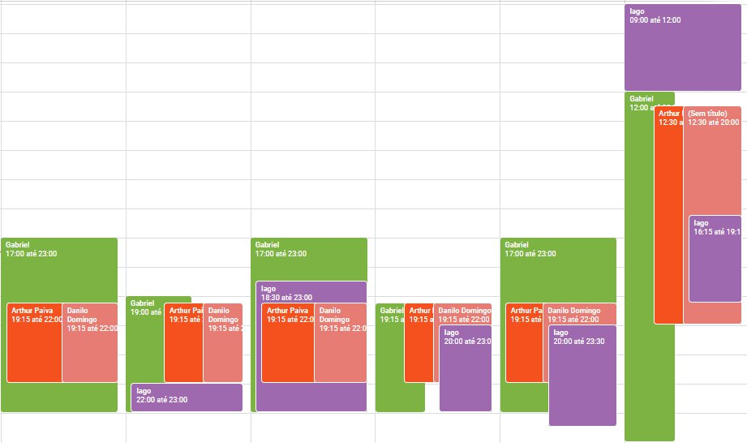

## Sobre
  O planejamento do projeto é extremamente importante pois irá ditar como o projeto será feito até o fim da disciplina. Trata de planejar, organizar e estruturar todas as atividades necessárias para elicitar os artefatos do aplicativo BRB Mobilidade durante o semestre. O planejamento também é importante para conseguir ajudar integrantes do grupo a se organizar em relação as entregas necessárias.

## Organização dos integrantes
  Com o obstáculo do ensino a distância e outros compromissos primeiro foi necessário encontrar horários em comum entre os integrantes do grupo para organizar chamadas a respeito das entregas e em geral auxílio durante a disciplina, para isso usamos o Google Agenda para observar quais horários livres eram compatíveis com o de outros membos e o resultado foi o seguinte, de segunda a sábado.

## Versionamento
| Versão| Data| Alteração | Integrante |
| :------------- :|:--------------:| :-----------:|:----------:|
| 1.0| 06/09 |Criação do pages e adição do planejamento| [Gabriel Hussein](https://github.com/GabrielHussein)|