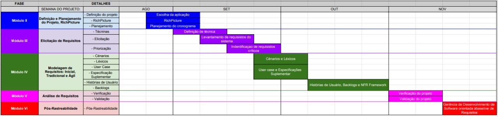

## Sobre
  O planejamento do projeto é extremamente importante pois irá ditar como o projeto será feito até o fim da disciplina. Trata de planejar, organizar e estruturar todas as atividades necessárias para elicitar os artefatos do aplicativo BRB Mobilidade durante o semestre. O planejamento também é importante para conseguir ajudar integrantes do grupo a se organizar em relação as entregas necessárias.

## Organização dos integrantes
  Com o obstáculo do ensino a distância e outros compromissos primeiro foi necessário encontrar horários em comum entre os integrantes do grupo para organizar chamadas a respeito das entregas e em geral auxílio durante a disciplina, para isso usamos o Google Agenda para observar quais horários livres eram compatíveis com o de outros membos e o resultado foi o seguinte, de segunda a sábado.

## Ferramentas utilizadas
| Ferramentas| Nome| Descrição |
| :------------- :|:--------------:| :-----------:|
| | Github|O Github será utilizado para versionamento e armazenamento de todos os documentos|
| | ZenHub |O Zenhub será utilizado para a organização e planejamento do grupo|
| | Google Drive |O Google Drive será utilizado para a criação de documentos compartilhaveís entre o grupo|
| | Telegram |O Telegram será utilizado para a comunicação do grupo|
| |  Microsoft Teams | O Microsoft Teams será utilizado para gravação das apresentações |

## Cronograma
A equipe utilizará um cronograma que separa em módulos cada entrega a ser feita na wiki

## Versionamento
| Versão| Data| Alteração | Integrante |
| :------------- :|:--------------:| :-----------:|:----------:|
| 1.0| 06/09 |Criação do pages e adição do planejamento| [Gabriel Hussein](https://github.com/GabrielHussein)|
| 1.1| 06/09 |Adição das imagens e nomes dos integrantes| [Arthur Paiva](https://github.com/ArthurPaivaT)|
| 1.2| 07/09 |Adição das Ferramentas utilizadas| [Iago Theóphilo](https://github.com/IagoTheophilo)|
| 1.3| 19/09 |Adição do cronograma| [Gabriel Hussein](https://github.com/GabrielHussein) e [Danilo Domingo](https://github.com/danilow200)|
| 1.4| 25/11 |Adição das ferramenta Microsoft Teams| [Iago Theóphilo](https://github.com/IagoTheophilo)|